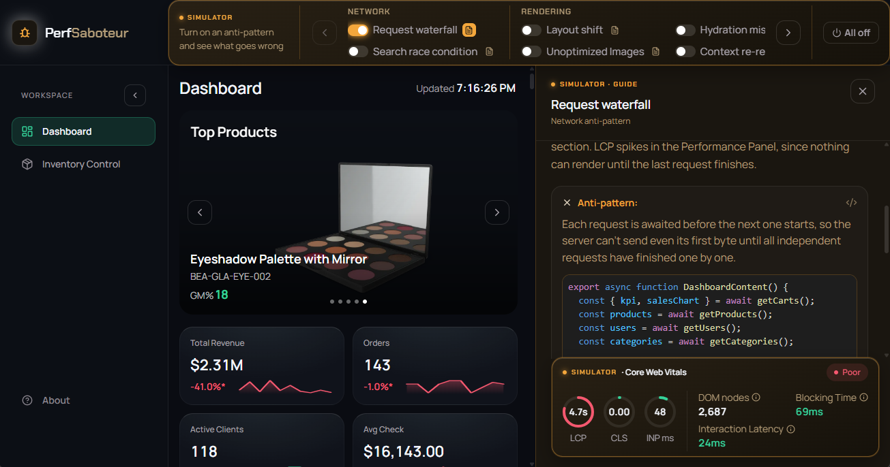

# PerformanceSaboteur - Frontend Anti-Patterns & Performance Sandbox 🚀

An interactive educational demo B2B analytics dashboard (Dashboard + Inventory Control) designed to visualize and measure the real-time impact of common frontend anti-patterns.

**Fully optimized for both desktop and mobile viewports — see how performance degrades on different form factors and hardware.**

**Stop talking about performance in theory — see it in action with live metrics.**

👉 <a href="https://performance-saboteur.vercel.app/" target="_blank" rel="noopener noreferrer"><strong>Live Demo Link</strong></a>



---

## ⚡ What is this?

This project looks and feels like a real, working production interface. However, it allows you to deliberately toggle well-known frontend performance bottlenecks to observe exactly how they affect core web vitals and user experience.

Instead of reading dry documentation, you can watch how the UI stutters, identify where the LCP/CLS hits come from, and examine side-by-side code comparisons.

## 🛠️ Features & Capabilities

- **Interactive Control Panel:** Toggle anti-patterns across three categories: Network, Rendering, and Computing.
- **Effect Stacking:** Combine multiple toggles to see how performance issues compound.
- **Live Metrics Tracker:** Watch LCP, CLS, INP, and other vital metrics update instantly at the bottom of the screen.
- **Flash on Update:** Visualize component re-renders in real-time under stress.
- **Case Guides:** Each toggle includes a short breakdown, reproduction steps, and a bad vs. good code comparison.

## 🧪 Anti-Pattern Cases

**Network**

| Case                      | Description                                                                                                                                  |
| ------------------------- | -------------------------------------------------------------------------------------------------------------------------------------------- |
| **Request waterfall**     | Independent data requests are awaited one after another instead of in parallel, so their delays stack up and LCP spikes.                     |
| **Search race condition** | Every keystroke fires its own request with no debounce or cancellation, so a slower response for an older query can overwrite a fresher one. |

**Rendering**

| Case                        | Description                                                                                                                                                                                                                                     |
| --------------------------- | ----------------------------------------------------------------------------------------------------------------------------------------------------------------------------------------------------------------------------------------------- |
| **Layout shift**            | A UI preference (like a collapsed sidebar) lives only in localStorage, so the server renders the wrong state first and the layout snaps into place after load, ticking up CLS.                                                                  |
| **Unoptimized images**      | The hero banner skips image optimization and priority hints, so the LCP element competes with off-screen images for bandwidth.                                                                                                                  |
| **Hydration mismatch**      | A value computed differently on the server than in the browser (like a live timestamp) makes the server-rendered HTML not match what the client expects, so React throws a hydration error and regenerates that part of the tree on the client. |
| **Context re-render storm** | Shared state lives in a Context instead of per-item store selectors, so every row or card re-renders on any single change.                                                                                                                      |

**Computing**

| Case                   | Description                                                                                                                                                                                                                      |
| ---------------------- | -------------------------------------------------------------------------------------------------------------------------------------------------------------------------------------------------------------------------------- |
| **Heavy mounting**     | A 2000+ row table mounts every row into real DOM at once instead of virtualizing, which freezes the page during transitions.                                                                                                     |
| **Broken memoization** | A component wrapped in `React.memo` still re-renders every time because its props aren't kept stable across renders (a fresh object or a raw ever-changing value instead of a derived one), so the memo comparison always fails. |

## 🧰 Tech Stack

- **Frontend:** Next.js 16 (App Router, TypeScript), React 19
- **Styling:** Tailwind CSS v4 + shadcn/ui
- **State Management:** Zustand
- **Metrics tracking:** Custom performance observers / Web Vitals API
- **Data:** DummyJSON (real HTTP calls, no local mocks)

## ⚙️ Local Development (Optional)

If you want to run this project locally:

1. Install dependencies:
   ```bash
   pnpm install
   ```
2. Run the development server:
   ```bash
   pnpm dev
   ```
3. Run tests:
   ```bash
   pnpm test
   pnpm test:e2e
   ```

---

💡 _Note: Blocking Time and Interaction Latency only update when a new qualifying event happens (e.g., a Long Task over 50ms). They represent the metric doing its job, not the current live state of the app._

💡 _Note: Fast CPUs, CDNs, and production build optimizations can sometimes mask how severe these anti-patterns look in the metrics. The effect of the same toggle may look far less pronounced on strong hardware than on an average device._
